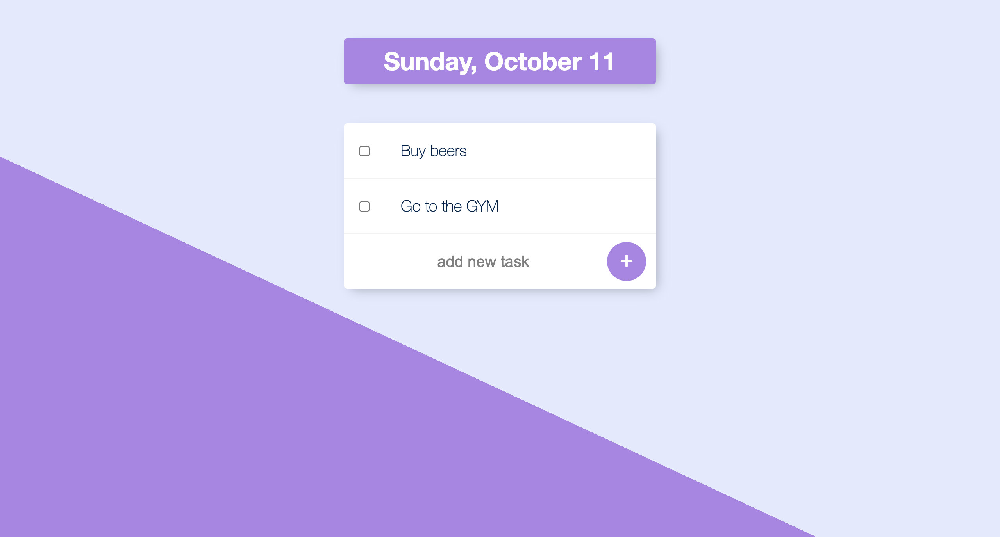

# :white_check_mark: TODO

- [x] ~~Styled To Do list~~
- [ ] Fork the project
- [ ] Clone it to your working directory
- [ ] open terminal and run `npm install`
- [ ] run `nodemon` and open [localhost:3000](http://localhost:3000/)

